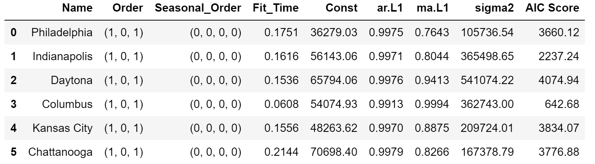

# Time Series Analysis of Zillow Data
Flatiron Data Science Project - Phase 4
 
         
<!---Photo by Kevork Kurdoghlian on Unsplash--->       
<!---Photo by <a href="https://unsplash.com/@pedroplus?utm_source=unsplash&amp;utm_medium=referral&amp;utm_content=creditCopyText">Pedro da Silva</a> on <a href="https://unsplash.com/s/photos/stop-sign?utm_source=unsplash&amp;utm_medium=referral&amp;utm_content=creditCopyText">Unsplash</a>--->
Prepared and Presented by:  **_Melody Peterson_**  
[Presentation PDF](https://github.com/melodygr/Classification_Project/blob/main/Terry%20Stop%20Presentation.pdf "Presentation PDF")

### Business Problem    
For this analysis I will be working as a Data Scientist for a financial investment firm that is looking for short-term real estate investment opportunities for it's smaller investors to diversify their investment profiles.  I will be analyzing median monthly housing sales prices for over 14,000 United States zipcodes and choosing the best areas to further analyze for potential investment. I will then forecast future real estate prices in those zip codes.   

### Data    
There are many datasets available on the [Zillow Research Page](https://www.zillow.com/research/data/).  The data used here represents median monthly housing sales prices for 14,723 zip codes over the period of April 1996 through April 2018 as reported by Zillow.  Each row represents a unique zip code. Each record contains location info and median housing sales prices for each month.  There are 14,723 rows and 272 variables: RegionID, RegionName (zip code), City, State, Metro, CountyName, SizeRank, finally 1996-04 through 2018-04 which represent 265 data points of monthly data for each zip code.  

### Modeling Process
Starting with the initial data cleaning/scrubbing phase, it was discovered that many zip codes did not have the full date range of data.  Some zip codes had data only going back to 06-2014.  I chose not to eliminate any zip codes for missing values but would model on the data available.  My next step was to calculate an ROI for each zip code that I could compare across all of the data, so for instance a 10 year ROI would not be possible.  Since my business case was for short term investment opportunities, a 10 year ROI would not be necessary.  I calculated a 4 year ROI and the most recent year (2018) ROI.  Finally I calculated the average one year ROI over the past 3 years and chose to use that as my comparison metric.  

Per my business problem, I was looking for the best ROI for small investors so I graphed ROI against the current Median Housing Price and then subset to the lower housing prices, eventually selecting six zip codes with high average ROI and low median housing prices for further analysis.  

Here is a comparison of the data on the 6 zip codes over time.  As you can see, Indianapolis and Columbus have limited data.  But generally they all reflect the housing market crash of 2009 and then these six zipcodes have shown significant increases over the past 4 years.

This graph of the Philadelphia data shows how each time series can be broken out into trend, seasonality, and noise components.  

Initial ARMA (Auto-regressive Moving Average) models were run on all 6 zip codes to establish a baseline for future models, and then several models were run and parameters tuned to find the model with the least error.  

  
         
           
         
### Model Parameter Comparison
The features importances of the two top performing model types show very little in common.

  

### Conclusions  
* Call Type of 911 appears to be important to the models
* Other 'Unknown' variables need to be reassessed
* Recommend engineering new target and features and remodeling

This may seem like a simple question at first glance, but there's more than a little ambiguity here that you'll have to think through in order to provide a solid recommendation. Should your recommendation be focused on profit margins only? What about risk? What sort of time horizon are you predicting against? Your recommendation will need to detail your rationale and answer any sort of lingering questions like these in order to demonstrate how you define "best".  

In addition to deciding which quantitative metric(s) you want to target (e.g. minimizing mean squared error), you need to start with a definition of "best investment". Consider additional metrics like risk vs. profitability, or ROI yield.  

### Next Steps / Future Work  
1. Further analyze unknown or missing values
1. Update ‘Arrest Flag’ with arrest values from ‘Stop Resolution’
1. Try no SMOTE
1. Tune Support Vector Classification

